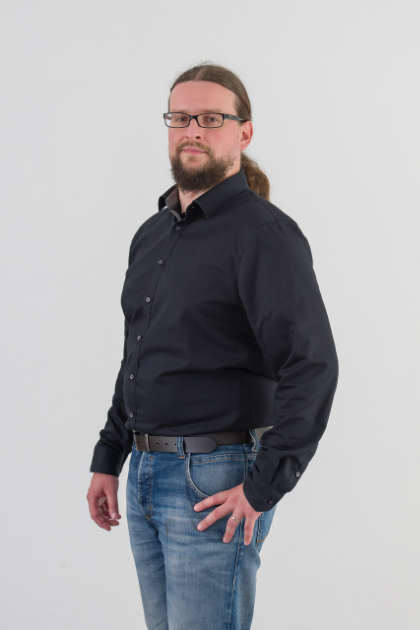

Ich bin seit 2010 in der IT-Branche unterwegs. Seit 2022 bin ich freiberuflicher IT-Architekt und Mitgründer von [DenktMit](). 





Zuvor war ich:
- Head of IT bei Habona Invest, einem Asset Manager aus Frankfurt am Main,
- Application Manager im Meldewesen bei der Union Investment,
- und Software Engineer in der Finanzbranche für die Cofinpro AG.

Ich konnte als IT-Architekt, Teamleiter, Projektleiter, Scrum Master, Softwareentwickler und als Verantwortlicher für den IT-Betrieb von Individual- und Standardsoftware Erfahrungen sammeln. 

Näheres in meinem [CV]() oder [LinkedIn Profil](https://www.linkedin.com/in/dmalolepszy) <a href="https://www.linkedin.com/in/dmalolepszy" style="text-decoration: none"></a>.

Heute fokussiere ich mich auf die [Entwicklung von Individualsoftware und Cloud-Infrastruktur]().
